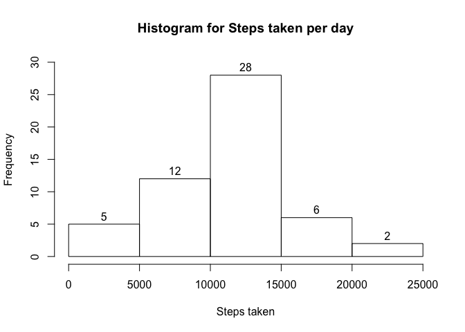
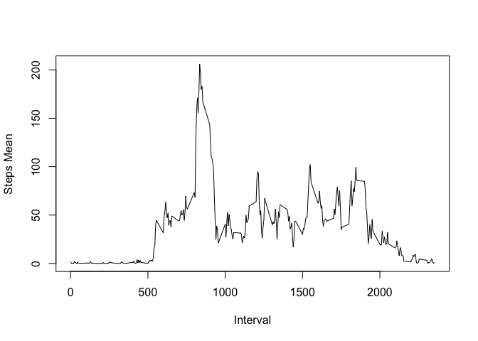
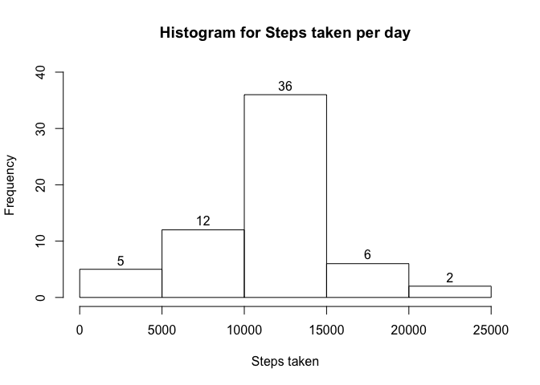
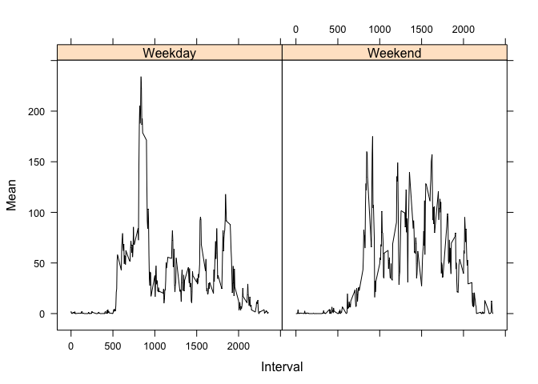

# Reproducible Research - Peer-graded Assignment: Course Project 1
This is a solution of the Peer-graded Assignment: Course Project 1 as part of the Reproducible Research Coursera course. 

###Set up the environment

```r
library("lattice")
setwd('/Users/petrpodrouzek/Documents/coursera/ReproducibleResearch/Week2/RepData_PeerAssessment1')
```
###Loading and preprocessing the data
Load the data and process/transform the data (if necessary) into a format suitable for your analysis.

```r
df <- read.csv("activity.csv", stringsAsFactors = FALSE)
df$date <- as.Date(df$date,"%Y-%m-%d")
head(df, 10)
```

```
##    steps       date interval
## 1     NA 2012-10-01        0
## 2     NA 2012-10-01        5
## 3     NA 2012-10-01       10
## 4     NA 2012-10-01       15
## 5     NA 2012-10-01       20
## 6     NA 2012-10-01       25
## 7     NA 2012-10-01       30
## 8     NA 2012-10-01       35
## 9     NA 2012-10-01       40
## 10    NA 2012-10-01       45
```
###What is mean total number of steps taken per day?
Calculate the total number of steps taken per day

```r
dfAgg<-setNames(aggregate(df$steps, by=list(Date=df$date), FUN=sum), c("date", "steps"))
head(dfAgg,10)
```

```
##          date steps
## 1  2012-10-01    NA
## 2  2012-10-02   126
## 3  2012-10-03 11352
## 4  2012-10-04 12116
## 5  2012-10-05 13294
## 6  2012-10-06 15420
## 7  2012-10-07 11015
## 8  2012-10-08    NA
## 9  2012-10-09 12811
## 10 2012-10-10  9900
```
Make a histogram of the total number of steps taken each day

```r
hist(dfAgg$steps,
     main="Histogram for Steps taken per day", 
     xlab="Steps taken", 
     ylim=c(0,30),
     breaks=5,
     labels=TRUE)
```

<!-- -->

Calculate and report the mean and median of the total number of steps taken per day

```r
mean(dfAgg$steps)
```

```
## [1] NA
```

```r
median(dfAgg$steps)
```

```
## [1] NA
```
###What is the average daily activity pattern?
Make a time series plot of the 5-minute interval (x-axis) and the average number of steps taken, averaged across all days (y-axis)

```r
df5MinMean <- setNames(aggregate(df$steps ~ df$interval, FUN = mean, na.rm=TRUE), c("Interval","Mean"))
plot(df5MinMean$Interval, df5MinMean$Mean, type="l", xlab="Interval", ylab="Steps Mean")
```

<!-- -->
Which 5-minute interval, on average across all the days in the dataset, contains the maximum number of steps?

```r
head(df5MinMean[order(-df5MinMean$Mean),],1)$Interval
```

```
## [1] 835
```
###Imputing missing values
Calculate and report the total number of missing values in the dataset 

```r
nrow(df[is.na(df$steps),])
```

```
## [1] 2304
```
Devise a strategy for filling in all of the missing values in the dataset. The strategy does not need to be sophisticated. For example, you could use the mean/median for that day, or the mean for that 5-minute interval, etc. Create a new dataset that is equal to the original dataset but with the missing data filled in.

```r
dfImpute <- merge(df,df5MinMean, by.x="interval", by.y="Interval")
dfImpute <- dfImpute[order(dfImpute$date, dfImpute$interval),]
dfImpute[is.na(dfImpute$steps),]$steps <- dfImpute[is.na(dfImpute$steps),]$Mean
dfImpute <- dfImpute[,1:3]
head(dfImpute,10)
```

```
##     interval     steps       date
## 1          0 1.7169811 2012-10-01
## 63         5 0.3396226 2012-10-01
## 128       10 0.1320755 2012-10-01
## 205       15 0.1509434 2012-10-01
## 264       20 0.0754717 2012-10-01
## 327       25 2.0943396 2012-10-01
## 376       30 0.5283019 2012-10-01
## 481       35 0.8679245 2012-10-01
## 495       40 0.0000000 2012-10-01
## 552       45 1.4716981 2012-10-01
```
Make a histogram of the total number of steps taken each day and Calculate and report the mean and median total number of steps taken per day. Do these values differ from the estimates from the first part of the assignment? What is the impact of imputing missing data on the estimates of the total daily number of steps?

It seems that the impact of the imputing is - mean and median can be now calculated (no NA values) and in the histogram, more days with (10000,15000) steps are present.  

```r
dfImputeAgg <- setNames(aggregate(dfImpute$steps, by=list(Date=df$date), FUN=sum), c("date", "steps"))
head(dfImputeAgg,10)
```

```
##          date    steps
## 1  2012-10-01 10766.19
## 2  2012-10-02   126.00
## 3  2012-10-03 11352.00
## 4  2012-10-04 12116.00
## 5  2012-10-05 13294.00
## 6  2012-10-06 15420.00
## 7  2012-10-07 11015.00
## 8  2012-10-08 10766.19
## 9  2012-10-09 12811.00
## 10 2012-10-10  9900.00
```

```r
hist(dfImputeAgg$steps,
     main="Histogram for Steps taken per day", 
     xlab="Steps taken", 
     ylim=c(0,40),
     breaks=5,
     labels=TRUE)
```

<!-- -->

```r
mean(dfImputeAgg$steps)
```

```
## [1] 10766.19
```

```r
median(dfImputeAgg$steps)
```

```
## [1] 10766.19
```
###Are there differences in activity patterns between weekdays and weekends?
Create a new factor variable in the dataset with two levels "weekday" and "weekend" indicating whether a given date is a weekday or weekend day.

```r
dfWeekdays<-df
dfWeekdays$NameOfTheDay<-weekdays(dfWeekdays$date)
dfWeekdays$IsWeekend<-"Weekday"
dfWeekdays[dfWeekdays$NameOfTheDay %in% c("Sunday", "Saturday"),]$IsWeekend <-"Weekend"
head(dfWeekdays,10)
```

```
##    steps       date interval NameOfTheDay IsWeekend
## 1     NA 2012-10-01        0       Monday   Weekday
## 2     NA 2012-10-01        5       Monday   Weekday
## 3     NA 2012-10-01       10       Monday   Weekday
## 4     NA 2012-10-01       15       Monday   Weekday
## 5     NA 2012-10-01       20       Monday   Weekday
## 6     NA 2012-10-01       25       Monday   Weekday
## 7     NA 2012-10-01       30       Monday   Weekday
## 8     NA 2012-10-01       35       Monday   Weekday
## 9     NA 2012-10-01       40       Monday   Weekday
## 10    NA 2012-10-01       45       Monday   Weekday
```
Make a panel plot containing a time series plot of the 5-minute interval (x-axis) and the average number of steps taken, averaged across all weekday days or weekend days (y-axis). See the README file in the GitHub repository to see an example of what this plot should look like using simulated data

```r
dfWeekdays5MinMean<- setNames(aggregate(dfWeekdays$steps ~ dfWeekdays$interval + dfWeekdays$IsWeekend, FUN = mean, na.rm=TRUE), c("Interval","IsWeekend","Mean"))
xyplot(Mean ~ Interval | IsWeekend,
       data = dfWeekdays5MinMean,
       type = "l",
       lty = c(1, 2, 2, 1),
       lwd = c(1, 1, 1, 3),
       col.line = c(rep("black",3), "red"))
```

<!-- -->


